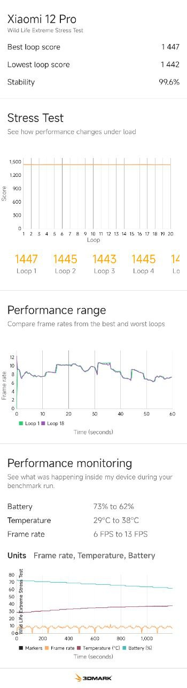

# Performance limit for Xiaomi 12 / 12 Pro

> Limit CPU and GPU performance to desired level on Xiaomi devices with Qualcomm Gen 1 CPU

With max power limit temperature remains below 50(C) degrees and stability is more than 99% in stress tests!

Tested on Xiaomi 12 Pro Global, Android 13, Xiaomi.eu 14.0.14.0

Confirmed to be working on Xiaomi 12, Xiaomi 12 Pro.

Geekbench 6 score: 860/3200 (similar to Huawei Mate 40)
<details> 
  <summary>3DMark Stress Test 20 minutes (`cpu_gpu_limit=3`)</summary>
  
</details>

## Setup

Download and install the module. See [Releases](https://github.com/mgrybyk/perf-limit-magisk/releases).

## Configuration

Config file location: `/sdcard/.perf-limit-magisk/config.prop`

Note: `.perf-limit-magisk` is a hidden folder.

No need to reboot the devices after making changes to the config!
Check magisk logs after making updating the config file. 
Your changes will be reflected within 20 seconds.

### cpu_gpu_limit

`cpu_gpu_limit`

- `0` - Disable limit completely
- `1` - Low GPU limit (6). CPU 1075200/1881600/1728000 (device is a bit less hot)
- `2` - Low GPU limit (6). CPU 1075200/1324800/1171200 (same as 1 but with lower CPU freqs)
- `3` - Average GPU limit (7). CPU 1075200/1881600/1728000 (device is less hot)
- `4` - Average GPU limit (7). CPU 1075200/1324800/1171200 (same as 3 but with lower CPU freqs)
- `5` - High GPU limit (8). CPU 1075200/1881600/1728000 (device is not hot)
- `6` - High GPU limit (8). CPU 1075200/1881600/1728000 (same as 5 but with lower CPU freqs)

Default: `cpu_gpu_limit=3`

Recommendations based on scenario:

- Levels 1 and 2 are not recommended.
- **Average day to day usage**: 3
- Navigation/Android Auto: 4 or 3
- Long time gaming ONLY: 6 or 5 (the higher GPU limit the better)

NOTE: set value back from 5 or 6 to something lower after gaming as far as the driver will disable GPU limit completely in apps like camera!

### Override max_pwrlevel

`max_pwrlevel` - Allow manually override CPU frequencies and GPU power limit.
`0` - disable limit. `8` - max power limit.
Reasonable values are `6`, `7`, `8`.

Example: `cpu_gpu_limit=7`

### Override policy0_scaling_max_freq

`policy0_scaling_max_freq` - I don't recommend to change this one unless you wan't to go below 1075200 for some reason.

CPUs 1-4. See `/sys/devices/system/cpu/cpufreq/policy0/scaling_available_frequencies` for available values.

Example: `policy0_scaling_max_freq=960000`

### Override policy4_scaling_max_freq

`policy4_scaling_max_freq` - Recommended values are from `1324800` to `1881600`.
Should be HIGHER than `policy7_scaling_max_freq`!

CPUs 5-7. See `/sys/devices/system/cpu/cpufreq/policy4/scaling_available_frequencies` for available values.

Example: `policy4_scaling_max_freq=1881600`

### Override policy7_scaling_max_freq

`policy7_scaling_max_freq` - Recommended values are from `1171200` to `1728000`.
Should be LOWER than `policy4_scaling_max_freq`!

CPU 8. See `/sys/devices/system/cpu/cpufreq/policy7/scaling_available_frequencies` for available values.

Example: `policy7_scaling_max_freq=1728000`

### Verbose logging

To enable verbose logging `enable_log=true`

## Logs

Example log output:

```
perf-limit: start, waiting for /sdcard
perf-limit: Writing default config to ./config.prop
perf-limit: cpu_gpu_limit=1
perf-limit: current kgsl gpu value is '6'
perf-limit: current policy 0 value is '1075200'
...
perf-limit: perf-limit service is running...
perf-limit: applying new values:
perf-limit: updating kgsl gpu to '8'
perf-limit: updating policy 4 to '1881600'
...
```
